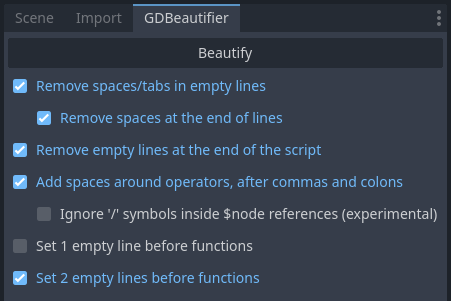

# GDBeautifier
A GDScript beautifier for [Godot Engine](https://github.com/godotengine/godot)

## Requirements
This addon is compatible with Godot 4.

## Features
GDBeautifier performs several optional cleaning tasks.
 * Removes spaces and tabs in empty lines
 * Removes spaces at the end of lines
 * Removes empty lines at the end of a script
 * Adds spaces around operators†
 * Adds a space after commas and colons
 * Adds 1 or 2 empty lines before any function

† Ignores / within $node references, unless aditional option toggled on
  note: $node references are assumed to start with $ and end with one of
  the following characters: . = : tab space or EOL

The addon ignores anything inside strings and comments.

## Installation
Add the addons folder to your project, and enable it in the plugins panel of the project settings.

## Usage
The beautifier panel is in the top left dock. It appears when the script editor is visible and a script is selected.  
Select the desired options and click on beautify. The current script will be beautified.  
You can undo if you change your mind.

## Licence
[Apache License 2.0](LICENSE.md)
